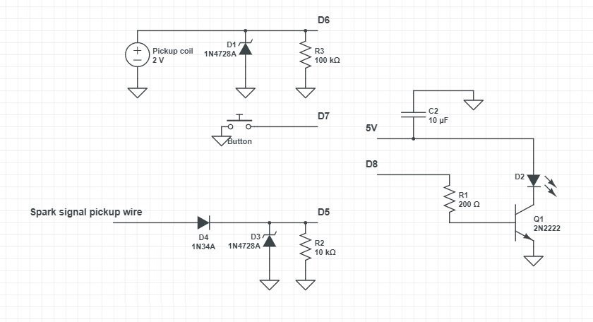
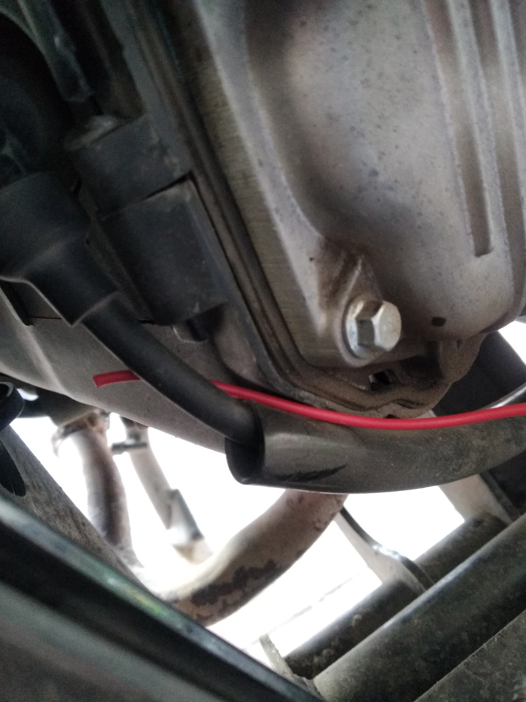
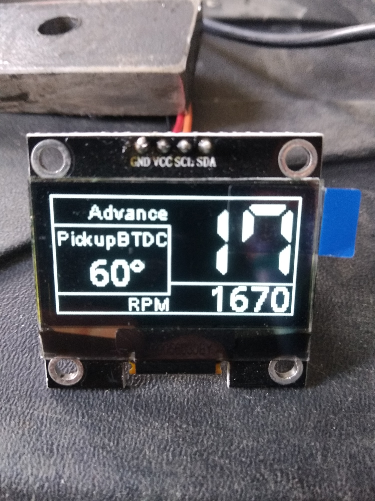

# ignition_advance
display ignition advance for scooter

Uses D1 Mini ESP8266 board and SH1106 display (D2=SDA, D1=SCL, 3V3=VCC, GND=GND). Can be used with SSD1306 display, just edit code accordingly. 

Hook up D6 to pickup coil signal, GND to ground and D5 just simple wire going near (or few turns around) spark plug wire. Button between D7 and GND.
D8 pin activates ignition timing light.

Schematic (i think 1N400x diode should work instead of 1N34A):

Spark pickup:

Short press button increases pickup coil advance by 1 degree, long press decreeses by 1 degree. After one minute of changing this value, it is saved to memory and will be remembered during reboots.

You need to know how many degrees BTDC pickup coil generates pulse. On my Piaggio LEADER 125 cc 2V engine it was about 60 degrees BTDC.

Code will calculate time between pickup coil signal and actual spark time and will calculate ignition advance.

RPM is also displayed.

Pickup coil signal:

